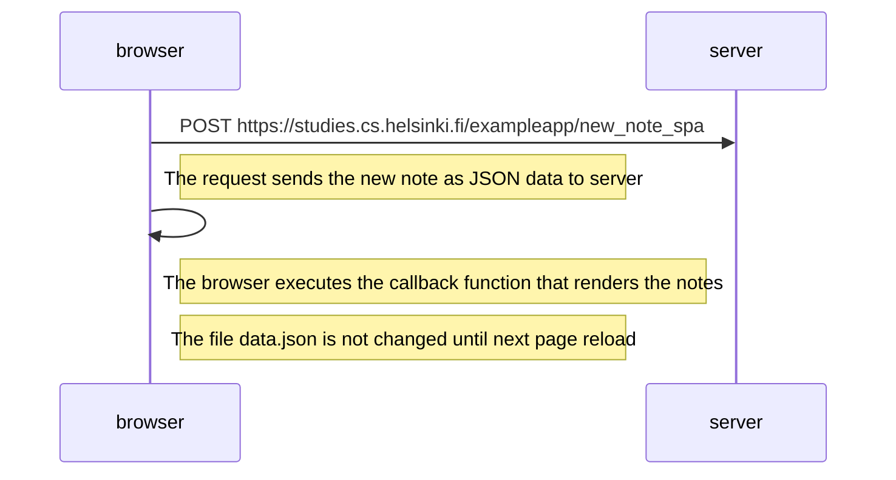

```mermaid
sequenceDiagram
    participant browser
    participant server

    browser->>server: POST https://studies.cs.helsinki.fi/exampleapp/new_note_spa
    Note right of browser: The request sends the new note as JSON data to server

    browser->>browser: 
    Note right of browser: The browser executes the callback function that renders the notes
    Note right of browser: The file data.json is not changed until next page reload
```
